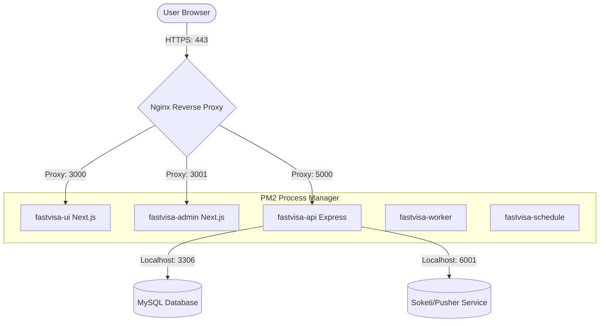

# FASTVISA E2E Production Deployment Design Document

This document outlines the architecture, security policies, configurations, and procedures to deploy the FASTVISA project end-to-end on a fresh Ubuntu VPS with IP `103.195.239.198`.

## 1. System Architecture

The deployment consists of 3 sub-projects running as local Node.js/Next.js/Express applications managed by PM2, with Nginx acting as a reverse proxy, MySQL 8.0 as the database engine, and Let's Encrypt Certbot for SSL.



### Port and Domain Matrix

| Public Domain | Frontend Protocol | Local Port | Root Path | PM2 App Name |
| :--- | :--- | :--- | :--- | :--- |
| **`vazi.io.vn`** | HTTPS (443) | `http://127.0.0.1:3000` | `/home/evisa/ui` | `fastvisa-ui` |
| **`admin.vazi.io.vn`** | HTTPS (443) | `http://127.0.0.1:3001` | `/home/evisa/admin` | `fastvisa-admin` |
| **`api.vazi.io.vn`** | HTTPS (443) | `http://127.0.0.1:5000` | `/home/evisa/api` | `fastvisa-api`<br>`fastvisa-worker`<br>`fastvisa-schedule` |

---

## 2. Security Configuration

### A. Non-Root Execution
To prevent critical security vulnerabilities, all application runtimes and builds will run under a limited-privilege OS user named `evisa`. Root access will only be used for system package installation and configuration of system-level services (Nginx, MySQL, Systemd).

### B. Database Hardening
MySQL will listen strictly on `127.0.0.1:3306`. It will block all external TCP access. Application access to MySQL is granted via a dedicated local user `evisa_user`.

---

## 3. Configuration Details

### A. Nginx Reverse Proxy Configs

#### Client UI (`vazi.io.vn`)
```nginx
server {
    listen 80;
    listen [::]:80;
    server_name vazi.io.vn;

    location / {
        proxy_pass http://127.0.0.1:3000;
        proxy_http_version 1.1;
        proxy_set_header Upgrade $http_upgrade;
        proxy_set_header Connection 'upgrade';
        proxy_set_header Host $host;
        proxy_cache_bypass $http_upgrade;
        proxy_set_header X-Real-IP $remote_addr;
        proxy_set_header X-Forwarded-For $proxy_add_x_forwarded_for;
        proxy_set_header X-Forwarded-Proto $scheme;
    }
}
```

#### Admin Dashboard (`admin.vazi.io.vn`)
```nginx
server {
    listen 80;
    listen [::]:80;
    server_name admin.vazi.io.vn;

    location / {
        proxy_pass http://127.0.0.1:3001;
        proxy_http_version 1.1;
        proxy_set_header Upgrade $http_upgrade;
        proxy_set_header Connection 'upgrade';
        proxy_set_header Host $host;
        proxy_cache_bypass $http_upgrade;
        proxy_set_header X-Real-IP $remote_addr;
        proxy_set_header X-Forwarded-For $proxy_add_x_forwarded_for;
        proxy_set_header X-Forwarded-Proto $scheme;
    }
}
```

#### Backend API (`api.vazi.io.vn`)
```nginx
server {
    listen 80;
    listen [::]:80;
    server_name api.vazi.io.vn;

    location / {
        proxy_pass http://127.0.0.1:5000;
        proxy_http_version 1.1;
        proxy_set_header Upgrade $http_upgrade;
        proxy_set_header Connection 'upgrade';
        proxy_set_header Host $host;
        proxy_cache_bypass $http_upgrade;
        proxy_set_header X-Real-IP $remote_addr;
        proxy_set_header X-Forwarded-For $proxy_add_x_forwarded_for;
        proxy_set_header X-Forwarded-Proto $scheme;
    }
}
```

### B. PM2 Ecosystem Configuration

Applications run in fork mode on Node.js using PM2. This guarantees automated autorestarts on crashes and auto-starting on server reboot.

```javascript
// ecosystem.config.cjs in each respective directory
// Admin: args: "start -p 3001"
// UI: args: "start -p 3000"
// API: 3 apps: fastvisa-api (port 5000), fastvisa-worker, fastvisa-schedule
```

---

## 4. Verification and Health Checks

Post-deployment, the following endpoints must be validated:
1. `GET https://api.vazi.io.vn/api/v1/health` -> Expects `{ "data": { "status": "ok" } }`
2. `GET https://vazi.io.vn` -> Expects UI home page
3. `GET https://admin.vazi.io.vn` -> Expects Admin login screen
