# Design Spec: Chat Handoff Status Animation & Fixes

**Date:** 2026-06-16
**Status:** Approved
**Scope:** Admin & UI — status messages khi chuyển chế độ AI ↔ Human, animation tuần tự, fix audio error, fix HANDBACK text

---

## 1. Tổng quan

Bốn vấn đề cần giải quyết trong cùng một lần triển khai:

1. **Admin audio crash** — `NotAllowedError: play() failed` khi có khách mới (user chưa tương tác với trang, browser chặn autoplay, promise không được catch → `unhandledRejection` trong terminal).
2. **Thiếu status message phía user khi admin chủ động bật Human** — `adminJoinSession` chỉ emit `admin_joined` event, không gửi `send_message` SYSTEM, user không thấy gì.
3. **`HANDBACK_SYSTEM_MESSAGE` thô trên admin** — API lưu key chứ không lưu text, admin render chuỗi thô; chỉ UI map sang i18n.
4. **Thiếu animation tuần tự cho status handoff trên admin** — Admin chưa có component tương đương `TypingBubbleWrapper` để hoạt ảnh chuỗi connecting → joined.

---

## 2. Luồng data sau khi fix

```mermaid
flowchart TD
    subgraph userRequest [User khởi động handoff]
        U1[User nhấn 'Gặp nhân viên'] --> U2["POST /chat/handoff"]
        U2 --> U3["emit send_message SYSTEM\n'Đang kết nối...'"]
        U2 --> U4["emit handoff_request\n→ admin panel"]
    end

    subgraph adminJoin [Admin tiếp nhận]
        A1["Admin nhấn toggle Human"] --> A2["POST /chat/admin-join"]
        A2 --> A3{"session.status trước đó?"}
        A3 -->|"AI_HANDLING\n(admin chủ động)"| A4["emit SYSTEM B1\n'Phiên chat đang được chuyển...'"]
        A3 -->|"HUMAN_HANDLING\n(user đã request)"| A5["skip B1"]
        A4 --> A6["emit SYSTEM joined\n'{adminName} đã tham gia...'"]
        A5 --> A6
        A6 --> A7["emit admin_joined event"]
    end

    subgraph handback [Admin trả về AI]
        H1["Admin nhấn toggle AI"] --> H2["POST /chat/handback"]
        H2 --> H3["lưu DB text thân thiện\n'Đã chuyển lại cho Trợ lý AI Kimi.'"]
        H3 --> H4["emit send_message SYSTEM text thân thiện"]
        H4 --> H5["emit handback event"]
    end

    subgraph adminAnimator [Admin UI — AdminHandoffStatusAnimator]
        AN1["Pusher handoff_request\nhoặc SYSTEM = user-ack"] --> AN2["state: CONNECTING"]
        AN2 --> AN3["slide up connecting text"]
        AN3 --> AN4["Pusher admin_joined\nhoặc SYSTEM = join text"]
        AN4 --> AN5["state: JOINED"]
        AN5 --> AN6["slide down joined text\n350ms → IDLE"]
    end

    userRequest --> adminAnimator
    adminJoin --> adminAnimator
```



---

## 3. Wording messages

| Key | Tiếng Việt | Trigger |
|-----|-----------|---------|
| `chat.handoff_user_ack` | `Đang kết nối bạn với nhân viên hỗ trợ, vui lòng chờ...` | User request (đã có) |
| `chat.handoff_admin_ack` | `Phiên chat đang được chuyển sang hỗ trợ từ nhân viên, vui lòng chờ trong giây lát...` | Admin chủ động (B1, mới) |
| `chat.admin_joined` | `{name} đã tham gia phiên hỗ trợ.` | Khi admin join xong |
| `chat.handback_system_message` | `Đã chuyển lại cho Trợ lý AI Kimi.` | Handback (đã có trong i18n) |

---

## 4. Chi tiết từng thành phần

### 4.1 API — `api/src/services/chat.service.ts`

**Hằng số:**

```typescript
const HANDOFF_USER_ACK = "Đang kết nối bạn với nhân viên hỗ trợ, vui lòng chờ..."
const HANDOFF_ADMIN_ACK = "Phiên chat đang được chuyển sang hỗ trợ từ nhân viên, vui lòng chờ trong giây lát..."
const HANDBACK_TEXT = "Đã chuyển lại cho Trợ lý AI Kimi."
```

**`adminJoinSession` — thêm emit `send_message`:**

Đọc `session.status` TRƯỚC khi update:
- Nếu `AI_HANDLING`: emit SYSTEM `HANDOFF_ADMIN_ACK` rồi mới emit SYSTEM `{adminName} đã tham gia phiên hỗ trợ.`
- Nếu `HUMAN_HANDLING` (user đã request trước): chỉ emit SYSTEM joined text, không lặp ADMIN_ACK.

Cả hai emit SYSTEM qua `emitSendMessage` (lưu DB + Pusher).

**`handbackChatSession` — thay raw key:**

```typescript
// Trước: originalText: "HANDBACK_SYSTEM_MESSAGE"
// Sau:
originalText: HANDBACK_TEXT
```

Emit `send_message` với `message: HANDBACK_TEXT` (hiện đang emit `sysMsg.originalText` — không cần đổi code emit, chỉ đổi constant).

**`requestChatHandoff` (user-initiated) — KHÔNG ĐỔI** `HANDOFF_USER_ACK` đã đúng.

---

### 4.2 Admin — fix audio crash

File: `admin/src/hooks/useAdminNotifications.tsx`

```typescript
// Trước:
void new Audio("/sounds/notification.mp3").play()

// Sau:
void new Audio("/sounds/notification.mp3").play().catch(() => {})
```

Hai chỗ: `admin_new_session` và `admin_handoff_request` handlers.

---

### 4.3 Admin — AdminChatMessage fix HANDBACK text

File: `admin/src/components/chat/AdminChatMessage.tsx`

Hiện tại (line ~209):

```tsx
if (isSystem) {
  return (
    <div className="flex justify-center my-2 w-full">
      <span ...>{message.text}</span>
    </div>
  )
}
```

Cần map giống UI: nếu `message.text === "HANDBACK_SYSTEM_MESSAGE"` hoặc text đã là friendly (từ fix API) thì giữ nguyên. Thêm guard:

```tsx
const displayText =
  message.text === "HANDBACK_SYSTEM_MESSAGE"
    ? "Đã chuyển lại cho Trợ lý AI Kimi."
    : message.text ?? ""
```

Sau khi API fix xong, key thô sẽ không xuất hiện nữa — guard này chỉ là safety net cho message cũ trong DB.

---

### 4.4 Admin — AdminHandoffStatusAnimator (component mới)

File: `admin/src/components/chat/AdminHandoffStatusAnimator.tsx`

**State machine:**

```typescript
type AnimatorState = "IDLE" | "CONNECTING" | "JOINED"
```

**Props:**

```typescript
interface AdminHandoffStatusAnimatorProps {
  connectingText: string   // B1 hoặc user-ack text từ session hiện tại
  joinedText: string       // "{adminName} đã tham gia phiên hỗ trợ."
  triggerState: AnimatorState
}
```

**Cách dùng:** mount ở cuối `AdminChatMessageList`, trên typing indicators. Component tự tính `triggerState` từ props `handoffPhase` được pass từ `useAdminChat`.

**Animation — reuse timing của `TypingBubbleWrapper` UI:**

```
CONNECTING show:  grid 0fr → 1fr, opacity 0→1, translateY(10px→0), 350ms ease-out
CONNECTING hide:  grid 1fr → 0fr, opacity 1→0, translateY(0→-10px), 350ms
JOINED show:      350ms sau khi connecting bắt đầu hide, cùng animation show
JOINED auto-hide: 3000ms, cùng animation hide
→ IDLE
```

**Late-join replay (admin mở trang sau khi handoff xảy ra):**

`useAdminChat` sẽ detect từ messages history:
- Có SYSTEM connecting text trong 120s qua, chưa có SYSTEM joined text → `CONNECTING`
- Có cả hai SYSTEM texts trong 120s qua → replay full sequence 1 lần khi mount

---

### 4.5 Admin — useAdminChat bổ sung handoffPhase

File: `admin/src/hooks/useAdminChat.ts`

Thêm state:

```typescript
const [handoffPhase, setHandoffPhase] = useState<"IDLE" | "CONNECTING" | "JOINED">("IDLE")
```

Bind thêm Pusher events:

```typescript
channel.bind("handoff_request", () => {
  setHandoffPhase("CONNECTING")
})

channel.bind("admin_joined", () => {
  setHandoffPhase("JOINED")
  setTimeout(() => setHandoffPhase("IDLE"), 3500)
})
```

Detect late-join từ history trong `loadMessages`:

```typescript
const now = Date.now()
const recent120s = (iso: string) => now - new Date(iso).getTime() < 120_000

const lastConnecting = data.messages
  .filter(m => m.sender_type === "SYSTEM" && (
    m.text?.includes("kết nối") || m.text?.includes("chuyển sang hỗ trợ")
  ))
  .findLast(() => true)

const lastJoined = data.messages
  .filter(m => m.sender_type === "SYSTEM" && m.text?.includes("đã tham gia"))
  .findLast(() => true)

if (lastConnecting && recent120s(lastConnecting.created_at)) {
  if (!lastJoined || new Date(lastJoined.created_at) < new Date(lastConnecting.created_at)) {
    setHandoffPhase("CONNECTING")
  } else if (recent120s(lastJoined.created_at)) {
    // Replay joined ngay khi mount
    setHandoffPhase("JOINED")
    setTimeout(() => setHandoffPhase("IDLE"), 3500)
  }
}
```

Export `handoffPhase` từ hook → pass vào `SessionChat` → pass vào `AdminChatMessageList` → pass vào `AdminHandoffStatusAnimator`.

---

### 4.6 Admin — AdminChatMessageList & SessionChat wiring

`AdminChatMessageList` nhận thêm prop:

```typescript
handoffPhase: "IDLE" | "CONNECTING" | "JOINED"
connectingText: string
joinedText: string
```

Render `<AdminHandoffStatusAnimator>` cuối list, trước `<div ref={bottomRef} />`.

`SessionChat` forward `handoffPhase`, `connectingText`, `joinedText` từ `chat` (hook).

---

## 5. Phạm vi file thay đổi

| File | Loại | Nội dung |
|------|------|---------|
| `api/src/services/chat.service.ts` | Sửa | Hằng số, `adminJoinSession` emit 2 SYSTEM msgs, `handbackChatSession` text thân thiện |
| `admin/src/hooks/useAdminNotifications.tsx` | Sửa | `.catch(() => {})` cho 2 Audio.play() |
| `admin/src/components/chat/AdminChatMessage.tsx` | Sửa | Guard HANDBACK_SYSTEM_MESSAGE |
| `admin/src/hooks/useAdminChat.ts` | Sửa | `handoffPhase` state, Pusher binds, late-join detect |
| `admin/src/components/chat/AdminHandoffStatusAnimator.tsx` | Tạo mới | Component animation state machine |
| `admin/src/components/chat/AdminChatMessageList.tsx` | Sửa | Props + render Animator |
| `admin/src/components/SessionChat.tsx` | Sửa | Forward props từ hook |

---

## 6. Edge cases

| Case | Xử lý |
|------|--------|
| Admin join ngay tức thì | CONNECTING → JOINED sequence, ~350ms gap |
| User request, admin join ngay | CONNECTING (user-ack đã trong list) → admin join → JOINED → IDLE |
| User request, admin vào muộn (>120s) | Late-join detect không trigger replay — animator ở IDLE |
| Admin refresh khi đang CONNECTING (<120s) | Late-join detect → CONNECTING cho đến khi joined |
| `[SYSTEM_HIDDEN]` | Vẫn filter, không ảnh hưởng |
| Message cũ trong DB có `HANDBACK_SYSTEM_MESSAGE` | Guard trong AdminChatMessage map sang friendly text |

---

## 7. Không nằm trong scope

- Thay đổi wording tiếng Anh/Hàn (i18n admin hiện dùng tiếng Việt hardcode, không có key system)
- Animation phía user UI (đã có TypingBubbleWrapper, SYSTEM messages render tĩnh là đủ)
- Âm thanh riêng cho handoff (dùng chung notification.mp3)
